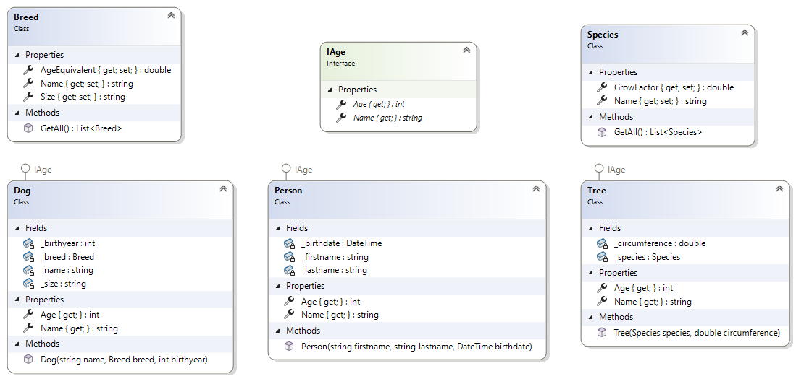
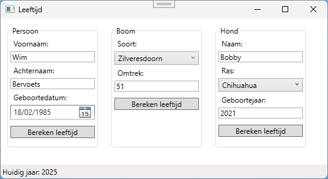
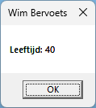
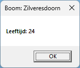
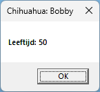

# AgeCalculator

## IAge
- Implementeer onderstaande diagram. Gebruik de *Models*-folder om de classes in aan te maken.


- Maak een *ShowAge* methode in het code-behind bestand van de MainWindow:
    ```csharp
    private void ShowAge(IAge objectWithAge)
    {
        MessageBox.Show(this, $"Leeftijd: {objectWithAge.Age}", objectWithAge.Name);
    }
    ```

- Voorzie de nodige eventprocedures om de 3 knoppen van functionaliteit te voorzien. **Elke eventprocedure maakt een object aan van het desbetreffende type en roept daarna de methode *ShowAge* aan.**
- Bekijk onderstaande screenshots aandachtig om zowel het MainWindow als de classes van de juiste functionaliteit te voorzien.

> [!TIP]
> De formule om de leeftijd van een boom te bepalen is *diameter x groeifactor*

> [!TIP]
> De formule om de leeftijd van een hond te bepalen is *leeftijd x equivalent*



| Person     | Tree        | Dog        | 
| ---------- | ----------- | ---------- |
|  |  |  |   
